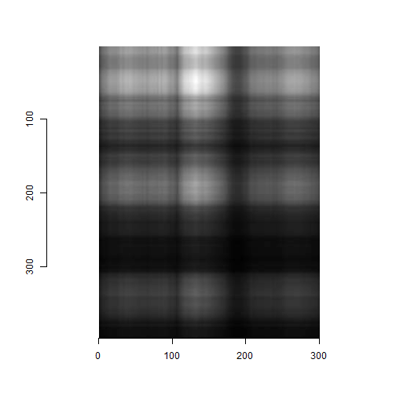

Data Science Educational Tools: A Visualization of Principal Component Analysis
========================================================
author: Kenon Vinson
date: February 3, 2019
autosize: true
transition: fade
font-family: 'Helvetica'

Data Science is an Emerging Field
========================================================

- More data is available than ever before.
- Advancements in technology has allowed the general public better access to powerful computing tools.
- There has been a growing interest in how we can best use this information boom alongside this technological growth.
- Data Science education is important to aid the interested in their pursuits.

Easy Access to Data Science Education
========================================================

Making Data Science education accessible to the public allows this emerging field to progress faster.
This has been achieved through efforts done through the Internet.
<br>
<br>
No other tool comes close to the ubiquity and accessibility of the Internet, making it the perfect platform for information relay.

Educational Tools on the Internet
========================================================

An advantage of online education is access to interactive learning tools.
<br>
<br>
While textbooks are great in their own right, educational tools on the internet allow immediate feedback to a learner's input.

Principal Component Analysis Basics Teaching Aid
========================================================
<br>
<font size = "5">An example of these interactive learning tools is the webpage on https://kenongab.shinyapps.io/ddp_final/
<br>
<br>
This page visualizes the effects of principal component analysis on data and explains why it is useful for Data Science. This is achieved by a code similar with the one on the right.</font>

***

<font size = "3">

```r
library(shiny)
library(jpeg)
library(imager)

temp <- tempfile(fileext = ".jpg")
mona <- readJPEG("./Gray-Scale-Mona-Lisa.jpg")
bw <- prcomp(mona[,,1], center = FALSE)
compressed <- bw$x[,1:1] %*% t(bw$rotation[,1:1])
writeJPEG(compressed, target = temp)
monacompressed <- load.image(temp)
plot(monacompressed)
```


</font>
